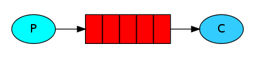
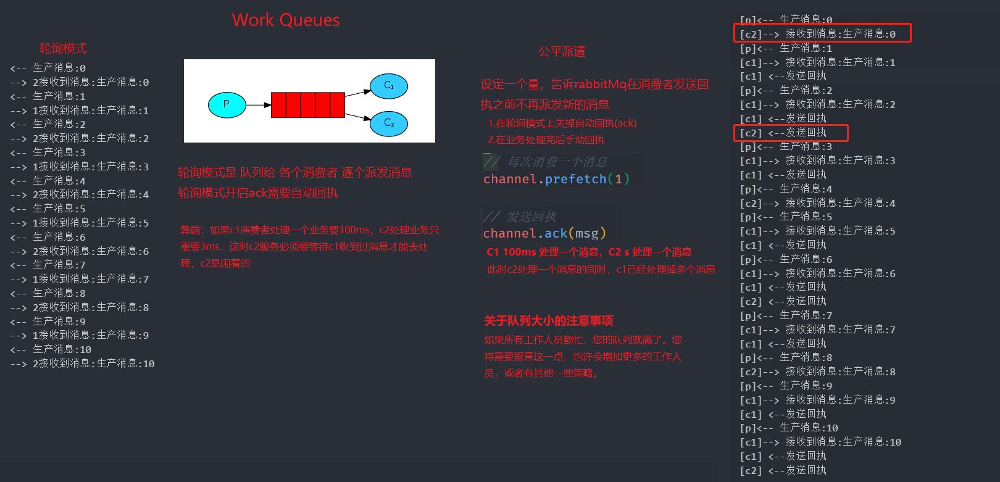

# RabbitMQ

# simplest 简单队列
一个生产者对应一个消费者

三个角色
- 消息生产者 `Producer`  
- 消息中间件（提供消息队列） `Queue`
- 消费消费者 `Consuming`

# Work Queues 工作队列
工作队列（又称任务队列）的主要思想是避免立即执行资源密集型任务，而不得不等待它完成。相反，我们安排任务在以后完成。我们将任务封装 为消息并将其发送到队列。在后台运行的工作进程将弹出任务并最终执行作业。当您运行许多工作人员时，任务将在他们之间共享。

- 工作队列 方式派发消息的方式的两种方式
    - 轮询
    - 任务队列
        1. 关闭自动回执(ack)
        2. 设置每次接受消息数
        2. 手动回执

    

# Publish/Subscribe 发布订阅

# Routing

# Topics

# RPC

# 消息应答和持久化

## 消息应答
- noAck   
    - `noAck = true` 自动确认模式 一旦mq将消息把消息分配给消费者，就会从内存中删除,如果业务方拿到消息并没有处理完，消息会丢失。
    - `noAck = false` 如果消费者挂了，没有发送回执，那么这条消息就没有被消费，会被其他消费者接收。**消费完成必须发送回执，告诉MQ已经消费完成**，不然会被其他消费者消费到

## 持久化

- **`MQ`是存在内存中的，如果它挂了,我们的消息依然会丢失！！** 但是！！`RabbitMQ`支持持久化
