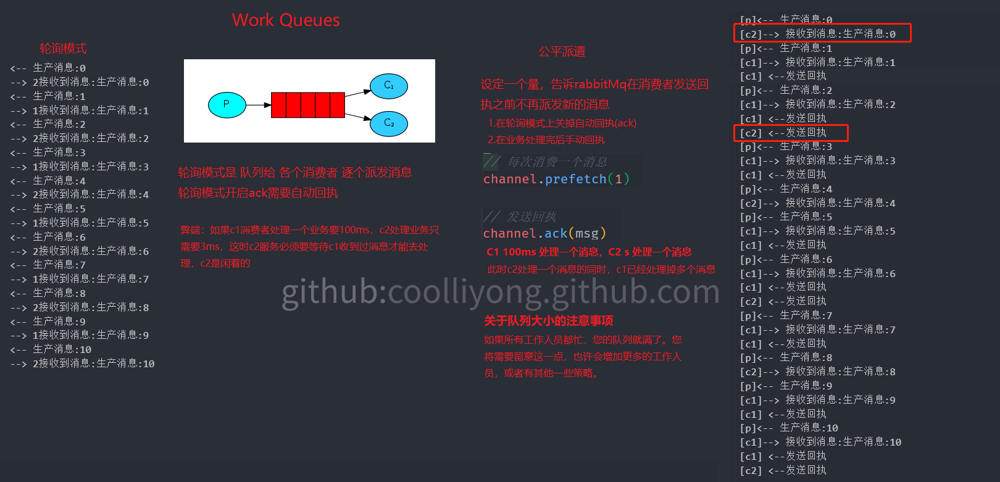
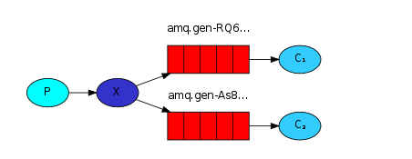
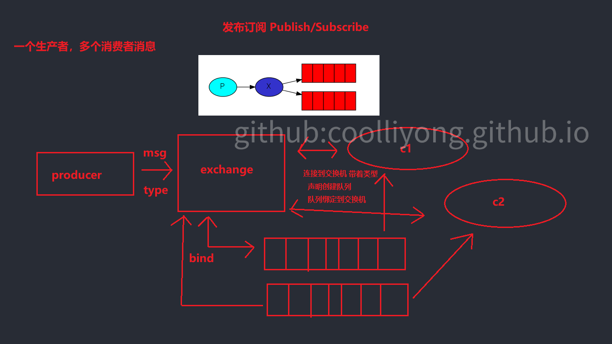
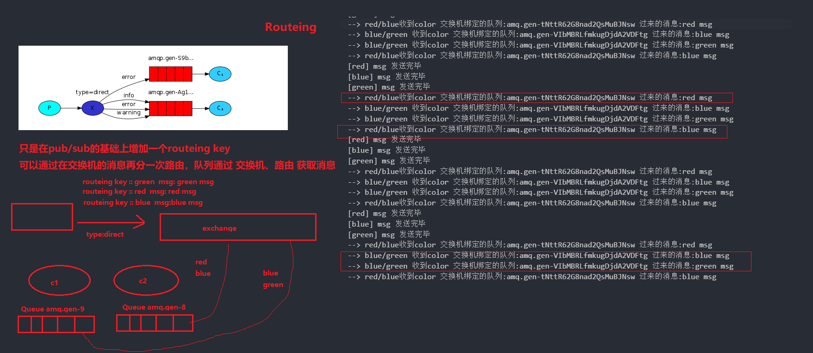
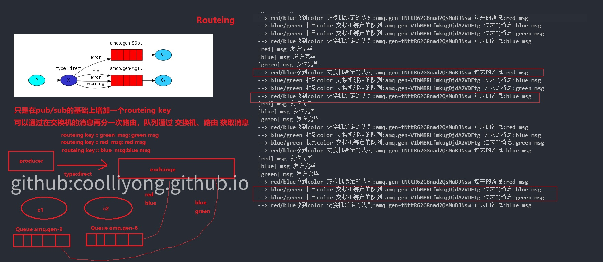
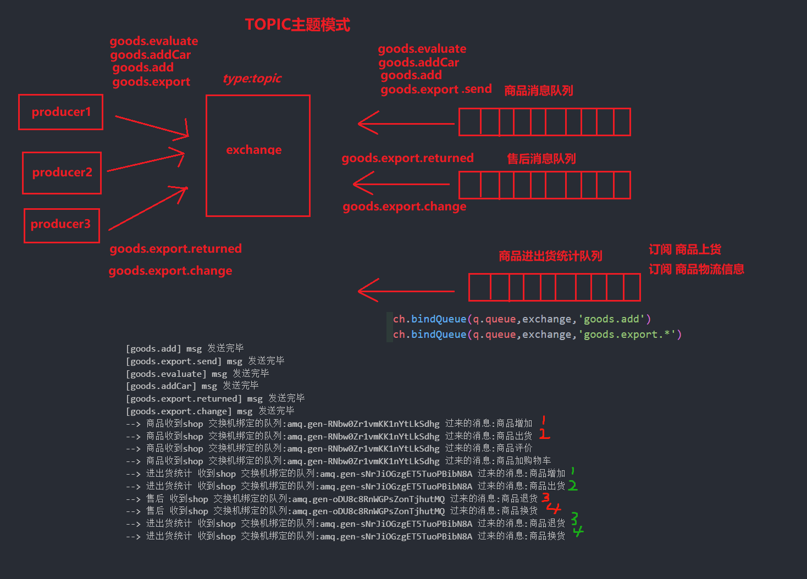

# RabbitMQ

## 场景
- 应用解耦（异步）
- 通知
- 限流
- 数据分发


## 概念
- 生产者 ：生产消息
- 消费者 ：接收消息的
- 消息队列 : 到达消费者前一刻存储的地方,因为消息也可以发给`exchange`，`exchange`肯定也有存储消息的地方
- 通道：建立在连接之上
- `Ack`回执：收到消息后确认消息已经消费的应答
- `exchange` 路由交换
- `routeing key` 路由键
- `topic` 主题


# simplest 简单队列


一个生产者对应一个消费者

三个角色

- 消息生产者 `Producer`
- 消息中间件（提供消息队列） `Queue`
- 消费消费者 `Consuming`


# Work Queues 工作队列/任务队列

## 工作队列模型



工作队列（又称任务队列）的主要思想是避免立即执行资源密集型任务，而不得不等待它完成。相反，我们安排任务在以后完成。我们将任务封装 为消息并将其发送到队列。在后台运行的工作进程将弹出任务并最终执行作业。当您运行许多工作人员时，任务将在他们之间共享。

- 工作队列 方式派发消息的方式的两种方式

  - 轮询
  - 任务队列
    1. 关闭自动回执(ack)
    2. 设置每次接受消息数
    3. 手动回执

  

# Publish/Subscribe 发布订阅

## 发布订阅模型



1. 一个生产者,多个消费者
2. 每一个消费者都有自己的队列
3. 生产者没有直接把消息发送到队列 而是发到了**交换机 转发器 exchange**
4. **每一个队列都要绑定到交换机上**
5. **生产者发送的消息 经过交换机 到达队列 就能实现一个消息被多个消费者消费**


大白话：  
- 一个富人说今天给`老人`（交换类型）发`钱`（消息）  
- 每一个 老人 带上自己的`碗`(队列)来装钱  

## x 交换机
交换机把消息推到队列里面

### 交换类型
- direct
- topic
- headers
- fanout




# Routing

## routeing 模型



在`pub/sub`的基础上增加了 `routeing key`,可以选择性的接收消息




# Topics


## 特殊`routeing key`字符
- `#` （哈希）可以替代零个或多个单词。
- `*` 可以代替一个单词。

**`exchange` 类型必须是`topic`**


# RPC

# 消息应答和持久化

## 消息应答

- noAck
  - `noAck = true` 自动确认模式 一旦 mq 将消息把消息分配给消费者，就会从内存中删除,如果业务方拿到消息并没有处理完，消息会丢失。
  - `noAck = false` 如果消费者挂了，没有发送回执，那么这条消息就没有被消费，会被其他消费者接收。**消费完成必须发送回执，告诉 MQ 已经消费完成**，不然会被其他消费者消费到

## 持久化

- **`MQ`是存在内存中的，如果它挂了,我们的消息依然会丢失！！** 但是！！`RabbitMQ`支持持久化

```js
channel.assertQueue(queue, {
  // 已经存在的队列不能修改
  // 非持久化
  durable: false
})
```
